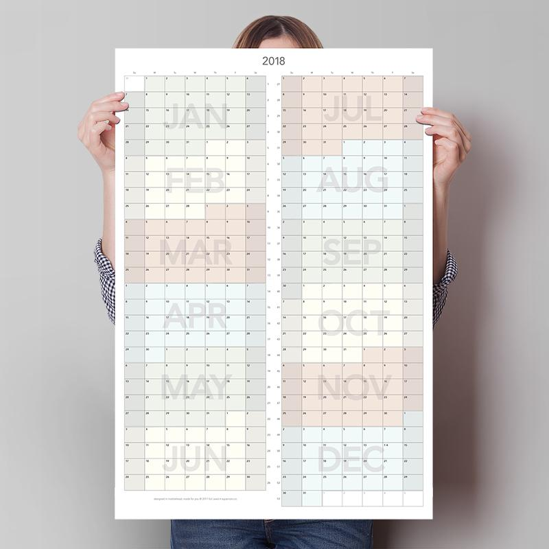

Time is continuous and the way we see time should reflect that. A few years ago I tried finding a calendar like this before giving up and designing my own. A friend suggested I make more with Kickstarter, which led to three successful campaigns for print runs. I've since moved to a print-on-demand system to not deal with inventory and be able to provide a lot more variations.

[Supamoto Calendars](https://www.supamoto.co)

